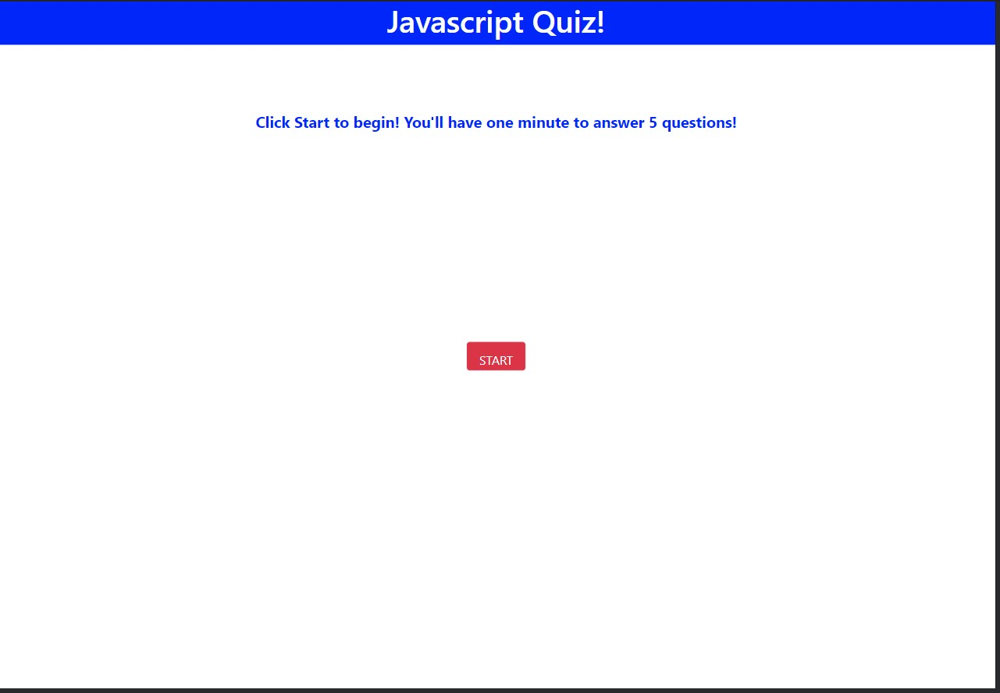

# JavaScript Quiz

## Description

This web app was built to practice using Web APIS, such as, but also it was used to familiarize myself with writing HTML, CSS, and Javascript. Dom manipulation was also a main factor in this project.

It is a fun little game that I can use to brush up on a couple questions. If so desired, I could continue the pattern established in script.js to add more questions.

## Installation

The web links to Bootstrap and JQUERY must still be active. Otherwise, no additional installation should be required.

## Usage

This image shows the web page on activation (after interacting with the prompt())

This image shows the general layout of the page while the quiz game is taking place.

This is what the web page looks like at the end of the game.

## Author
Ryan Pinkston